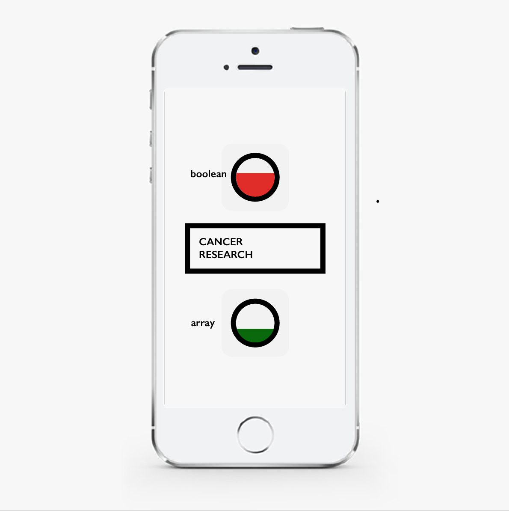
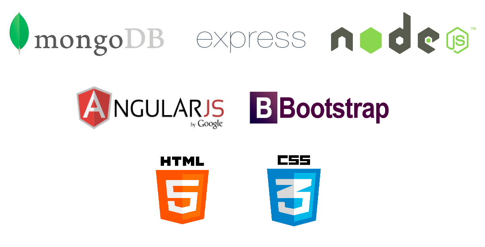

# chariot

Gamify your donations

## Summary

- In the run-up to Christmas, challenge your co-workers - who can raise the most money for the charity before the deadline.
- Two teams. 1 charity. 1 goal.

This app was created as part of a 24 hour hackathon during General Assembly's Web Development Immersive course.

## The team

Barney Goff [bg181](https://github.com/bg181)
Sareh Heidari [sareh](https://github.com/sareh)
Ollie Holden [odholden](https://github.com/odholden)
Ben Layer [benlayer291](https://github.com/benlayer291)
Rob Wilson [phobos101](https://github.com/phobos101)

## What we used

